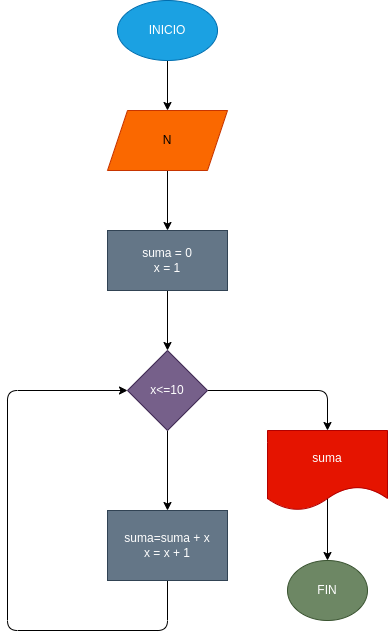

# suma_N_primeros_naturales

crear un programa para sumar los numeros naturales hasta el que definimos

# ANÁLISIS

entrada
norte
proceso
x=1
suma = o
sumar el resultado de "suma" con X
suma X + 1
salida
resultado de sumar todos los numeros naturales hasta el numero N

# DISEÑO

# CONSTRUCCION